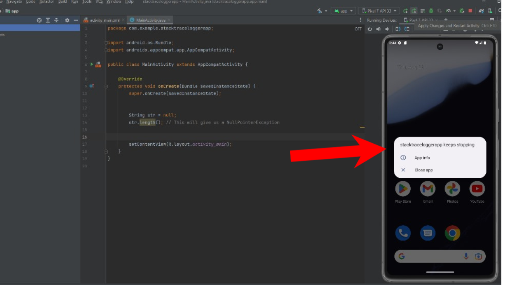
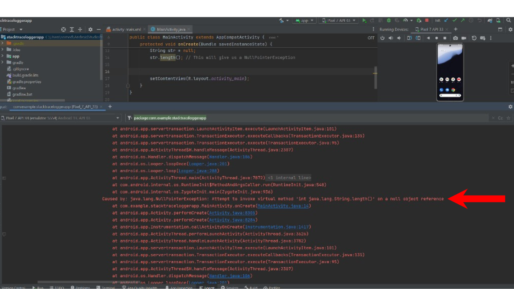

# Stack Trace Debugging

## Introduction

A stack trace is a report that provides information about the sequence of method calls that led to an error in your program. It is an essential tool for debugging as it helps pinpoint where and why an error occurred.

## How to Apply Stack Trace Debugging

1. **Identify the Error**: When your application crashes or behaves unexpectedly, an error message will usually appear. This message often includes a stack trace, which contains details about the error.

2. **Examine the Stack Trace**: Look at the stack trace to identify the sequence of method calls that led to the error. The stack trace will show the line numbers and methods involved, which can help you locate the source of the problem.

3. **Locate the Source of the Problem**: Use the information from the stack trace to find the specific code that caused the error. This may involve opening the relevant files and examining the lines mentioned in the stack trace.

4. **Fix the Issue**: Once you’ve identified the problematic code, make the necessary changes to fix the error. Common fixes include initializing objects, correcting method calls, or handling exceptions properly.

5. **Verify the Fix**: After making changes, re-run your application to ensure that the issue is resolved and that no new errors have been introduced.

## Example Application

In this example, we will address an issue with a simple Android application. The application had a problem with a `NullPointerException`, causing it to crash.

### Problem Description

This app had a problem where a `NullPointerException` was triggered due to an attempt to call a method on a null object. This caused the app to crash.

#### Stack Trace Before Fix

The application crashed due to a `NullPointerException`. The image below shows the app crashing when it tries to execute code with a null object.



*Image showing the application crashing due to a null pointer exception.*

### Using Stack Trace to Debug

By examining the stack trace report, we can identify where the problem occurred. The stack trace provides a detailed sequence of method calls that led to the error, which helps us pinpoint the exact location in the code that needs to be fixed.

#### Stack Trace Report

The stack trace report highlights the method calls and line numbers where the error occurred. This information is crucial for understanding why the error happened and how to address it.



*Image showing the stack trace report with details about the error.*

### Fixing the Issue

To resolve the `NullPointerException`, we need to ensure that the object is properly initialized before calling any methods on it. 

```java
package com.example.stacktraceloggerapp;

import android.os.Bundle;
import androidx.appcompat.app.AppCompatActivity;

public class MainActivity extends AppCompatActivity {

    @Override
    protected void onCreate(Bundle savedInstanceState) {
        super.onCreate(savedInstanceState);

        // Initialize the object to prevent NullPointerException
        String str = "Hello, World!";
        str.length(); // No crash occurs now

        setContentView(R.layout.activity_main);
    }
}
```
the app will now work

